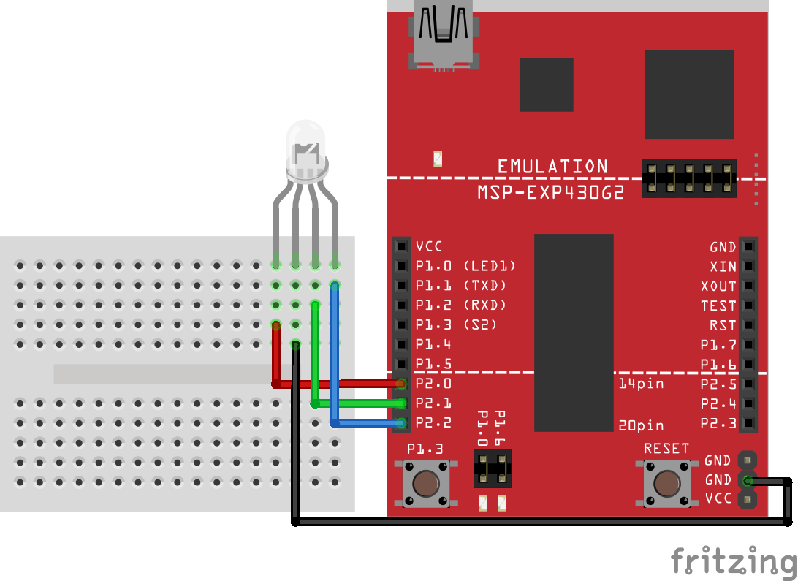

# Assignment Two: RGB LED

### Schematic

### Objective

For this assignment, you should try to cycle through the available colors on your RGB LED slowly and, when the onboard switch is pressed, display the current color to the screen using `cio_printf()`. The following colors can be displayed:

1. Red
1. Green
1. Blue
1. Yellow
1. Cyan
1. Purple
1. White

Here is sample output from `screen`/`minicom`:

    > OFF
    > RED
    > GREEN
    > BLUE
    > YELLOW
    > CYAN
    > PURPLE
    > WHITE

##### Note: `OFF` is part of the color cycling, so there are 8 different "colors" to display.

The order in which they are displayed isn't that important, but the above order makes a bit of sense. Attempt to cycle it in this order. You should use an _interrupt_ to print the name of the color to the screen while the main loop consists of cycling through the colors. The included code has something set up for you (see the comments).

For this assignment, you should try to construct an array manually in assembly. The template has an array built with two entries. Pay attention to how it is created! It should be sufficient to simply extend it to accommodate the extra entries.

All the button interrupt has to do is print out the current color. You will have to track this in some way, there are probably a few different strategies, but using a register as a pointer to each of the array entries is quite useful and can reduce the amount of code you need to write. **Writing code as general as possible is a very important skill to learn.** Hard-coding values can cause bugs when you inevitably have to modify the code later.

When you have an issue or you are getting unexpected results, _reach for the debugger_. This is your best view into how the CPU is operating at any given moment. Confirm the contents of registers or the arguments of function calls. There are many resources available on different `gdb` commands, but I've [tried to collect important ones here](https://maccreery.cs.wmich.edu/cs2230/linux/compiler_and_debugger/).

